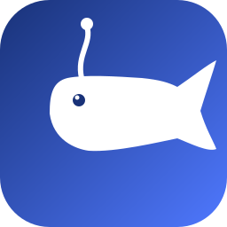

# DeepSeek Harness Installer

English | [中文](README.zh.md)

One-click installer for [DeepSeek Harness](https://github.com/deepseek-ai/deepseek-harness) (`dsh`) — an open-source agent harness developed by DeepSeek AI.

This tool automatically:
- Installs the `@deepseek-ai/dsh` npm package globally
- Generates a custom whale-themed desktop icon
- Creates a one-click desktop shortcut that starts the service and opens the browser

## Preview

The shortcut icon features a white whale (DeepSeek's brand mascot) on a blue gradient background:



## Prerequisites

- **Node.js** v18+ — Download from https://nodejs.org/

## Quick Start

### Windows

```powershell
git clone https://github.com/plkiouyhh-max/deepseek-harness-installer.git
cd deepseek-harness-installer
powershell -ExecutionPolicy Bypass -File scripts/install.ps1
```

<details>
<summary><b>Need a custom desktop path? (Click to expand)</b></summary>

Most users **don't need this** — the script auto-detects your desktop. But if your desktop has been moved to another drive (e.g., `D:\` or `E:\`), you can specify it manually.

**How to find your desktop path:**

**Method 1** — File Explorer:
1. Open File Explorer
2. Right-click **Desktop** in the left sidebar → **Properties**
3. Check the **Location** field

**Method 2** — PowerShell:
```powershell
[Environment]::GetFolderPath("Desktop")
```
This prints your desktop path, e.g., `C:\Users\YourName\Desktop` or `D:\Desktop`.

Then install with the `-DesktopPath` parameter:
```powershell
powershell -ExecutionPolicy Bypass -File scripts/install.ps1 -DesktopPath "D:\Desktop"
```

</details>

### macOS / Linux

```bash
git clone https://github.com/plkiouyhh-max/deepseek-harness-installer.git
cd deepseek-harness-installer
chmod +x scripts/install.sh
./scripts/install.sh
```

## What Happens During Installation

| Step | Windows | macOS / Linux |
|------|---------|---------------|
| 1. Check Node.js | `node --version` | `node --version` |
| 2. Install dsh | `npm install -g @deepseek-ai/dsh` | `sudo npm install -g @deepseek-ai/dsh` |
| 3. Generate icon | System.Drawing (256x256 .ico) | Copy SVG icon |
| 4. Create shortcut | `.bat` launcher + `.lnk` shortcut | `.command` (macOS) / `.desktop` (Linux) |

## Using the Shortcut

1. **Double-click** the "DeepSeek Harness" shortcut on your desktop
2. The shortcut will:
   - Check if `dsh web` is already running (port 3080)
   - Start the service if not running
   - Wait for it to be ready (polls every 2 seconds)
   - Open your browser at `http://127.0.0.1:3080`
3. On first launch, configure your model:
   - Go to **Settings → Models**
   - Enter your DeepSeek API Key
   - Save
4. Select a workspace directory
5. Start a session and send tasks!

## Project Structure

```
deepseek-harness-installer/
├── README.md              # English documentation
├── README.zh.md           # Chinese documentation
├── SKILL.md               # AI agent skill definition
├── LICENSE                # MIT license
├── assets/
│   └── dsh-icon.svg       # Icon source (SVG)
└── scripts/
    ├── install.ps1        # Windows installer
    └── install.sh         # macOS / Linux installer
```

## Using as an AI Agent Skill

This project includes a `SKILL.md` file that allows any AI agent (TRAE, Claude Code, etc.) to execute the installation automatically.

### For TRAE Users

Copy the `SKILL.md` to your `.trae/skills/deepseek-harness-installer/` directory:

```bash
mkdir -p .trae/skills/deepseek-harness-installer
cp SKILL.md .trae/skills/deepseek-harness-installer/
```

Then simply ask your agent: *"Install DeepSeek Harness and create a desktop shortcut."*

### For Other Agents

The `SKILL.md` contains step-by-step instructions that any agent can follow. Point your agent to this repository and ask it to run the installation.

## Manual Installation (No Script)

If you prefer to do it manually:

```bash
# 1. Install dsh
npm install -g @deepseek-ai/dsh

# 2. Start the Web UI
dsh web

# 3. Open browser to http://127.0.0.1:3080
```

## Troubleshooting

| Problem | Solution |
|---------|----------|
| `dsh` command not found | Restart terminal, or add npm global bin to PATH |
| Port 3080 already in use | Close existing `dsh web` process |
| Icon not showing (Windows) | Press F5 to refresh desktop |
| npm permission error (Linux/macOS) | Use `sudo npm install -g @deepseek-ai/dsh` |

## About DeepSeek Harness

DeepSeek Harness is an open-source agent harness developed by DeepSeek AI. It uses an "everything is a plugin" architecture powered by Cordis.

- **Repository**: https://github.com/deepseek-ai/deepseek-harness
- **License**: MIT
- **Status**: Developer Preview (0.1.0-rc.x)

## License

MIT — See [LICENSE](LICENSE)
